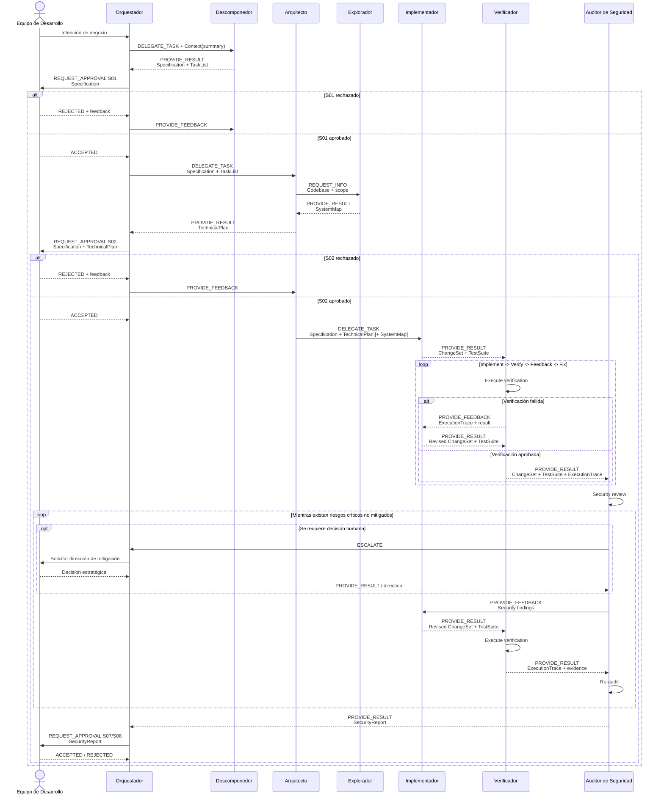

# PSM Codex — Core-V1 / Minimum Viable Instantiation

Scaffolding mínimo y ejecutable que materializa el PIM de referencia mediante mecanismos nativos de Codex y convenciones versionadas del workspace. No implementa funcionalidad de negocio.

## Frontera de implementación

- **NATIVE Codex:** hilo principal como Orchestrator, subagent threads efímeros, RoleProfiles en `.codex/agents/`, Skills bajo demanda y sandbox de Codex.
- **WORKSPACE-CONVENTION:** contratos lógicos TOML, referencias de artifacts, Gates y trazas append-only en JSONL.
- **DEFERRED:** Reflector, Curator, EpisodicMemory, SemanticMemory nueva, learning loop, promoción/evolución de memoria o Skills, TDD obligatorio, RAG, bases vectoriales, MCP, event bus, orchestrator externo y worktrees por agente.

TDD queda diferido como posible estrategia procedural intercambiable, no como flujo obligatorio de Core-V1. SemanticMemory sólo se añadirá si existe conocimiento estable que no esté ya expresado en README, ADRs, documentación o specs.

## Estructura

```text
.
|-- AGENTS.md
|-- README.md
|-- .codex/
|   |-- config.toml
|   `-- agents/{decomposer,architect,explorer,implementer,verifier,security-auditor}.toml
|-- .agents/skills/
|   |-- architecture-planning/SKILL.md
|   |-- codebase-exploration/SKILL.md
|   `-- security-review/SKILL.md
|-- .framework/
|   |-- contracts.toml
|   |-- validate_handoff.py
|   `-- runs/<run-id>/events.jsonl
`-- specs/<feature-id>/
    |-- specification.md
    |-- system-map.md
    |-- technical-plan.md
    `-- security-report.md
```

## Topología PSM Core-V1

```mermaid
flowchart TB
    TEAM["Equipo de Desarrollo"]

    subgraph CODEX["Codex Runtime — NATIVE"]
        OR["Primary Thread<br/>Orchestrator Agent"]
        DC["Subagent<br/>Decomposer"]
        AR["Subagent<br/>Architect"]
        EX["Subagent<br/>Explorer"]
        IM["Subagent<br/>Implementer"]
        VR["Subagent<br/>Verifier"]
        AS["Subagent<br/>Security Auditor"]
        TOOLS["Filesystem / Shell / Git<br/>Sandbox + Approvals"]
        SKILLS["Native Skill Loader<br/>Progressive Disclosure"]
    end

    TEAM <-->|"único canal físico"| OR
    OR -->|"spawn / relay"| DC
    OR -->|"spawn / relay"| AR
    OR -->|"spawn / relay"| EX
    OR -->|"spawn / relay"| IM
    OR -->|"spawn / relay"| VR
    OR -->|"spawn / relay"| AS

    DC --- TOOLS
    AR --- TOOLS
    EX --- TOOLS
    IM --- TOOLS
    VR --- TOOLS
    AS --- TOOLS
    AR --- SKILLS
    EX --- SKILLS
    AS --- SKILLS

    subgraph CONFIG["Workspace Control — VERSIONED"]
        AGENTS["AGENTS.md<br/>global invariants"]
        ROLECFG[".codex/agents/*.toml<br/>RoleProfiles"]
        CONTRACTS[".framework/contracts.toml<br/>IOContract + AccessPolicy"]
        VALIDATOR["validate_handoff.py"]
    end

    subgraph STATE["Workspace State — VERSIONED"]
        SPEC["Specification / TaskList"]
        MAP["SystemMap"]
        PLAN["TechnicalPlan"]
        CODE["Codebase + ChangeSet<br/>Git"]
        TESTS["TestSuite"]
        SEC["SecurityReport"]
        TRACE["runs/&lt;id&gt;/events.jsonl<br/>Handoffs + ExecutionTrace"]
    end

    DEFERRED["SemanticMemory<br/>DEFERRED — no knowledge.md"]

    AGENTS --> OR
    ROLECFG --> DC
    ROLECFG --> AR
    ROLECFG --> EX
    ROLECFG --> IM
    ROLECFG --> VR
    ROLECFG --> AS
    OR --> VALIDATOR
    VALIDATOR --> CONTRACTS
    OR <--> SPEC
    OR <--> MAP
    OR <--> PLAN
    OR <--> SEC
    OR <--> TRACE
    IM <--> CODE
    IM <--> TESTS
    VR --> TESTS
    VR --> CODE
    AS --> CODE
    AS --> TESTS
```



`max_concurrent_threads_per_session = 1` conserva la ejecución secuencial. Cuando un flujo lógico requiere volver a un RoleProfile —por ejemplo, Architect después de Explorer— Orchestrator puede abrir una nueva instancia runtime del mismo perfil y reconstruir su Context mínimo desde resumen, Gate y referencias persistidas. La identidad reusable está en RoleProfile; Agent es la instancia runtime.

## Mapping PIM → PSM

| Concepto PIM | Materialización Core-V1 |
|---|---|
| Agent | hilo principal o subagent thread |
| RoleProfile | custom agent TOML; Orchestrator es el hilo principal |
| Capability | declaración de rol + instrucciones/Skills/tools |
| ProceduralMemory | Skill sustancial reusable o instrucción inline trivial |
| IOContract / AccessPolicy | `.framework/contracts.toml` |
| Handoff | mensaje runtime + eventos JSONL |
| Context | resumen y referencias seleccionadas, construido dinámicamente |
| Artifact | referencia lógica inequívoca al filesystem o Git |
| EpisodicMemory / SemanticMemory | diferidas |

Una Skill puede materializar conjuntamente parte de Capability y ProceduralMemory sin hacerlos ontológicamente equivalentes. ActivatedSkills tampoco son ContextSource. Las políticas de acceso son lógicas; el sandbox y las instrucciones sólo aplican el enforcement técnicamente disponible.

| RoleProfile | Procedimiento Core-V1 |
|---|---|
| Orchestrator | invariantes de `AGENTS.md` |
| Decomposer | instrucciones inline |
| Architect | Skill `architecture-planning` |
| Explorer | Skill `codebase-exploration` |
| Implementer | instrucciones inline |
| Verifier | instrucciones inline |
| SecurityAuditor | Skill `security-review` |

Una Skill no es RoleProfile, Capability, ProceduralMemory, ContextSource ni Artifact. En Core-V1 es el mecanismo nativo que materializa parte de una Capability junto con conocimiento procedural reusable. Las tres Skills permanecen sin cambios y se activan sólo bajo demanda.

## Artifacts

El identificador lógico sigue `A:<ArtifactSubtype>:<feature-id>[:<name>]`.

| ArtifactSubtype | Representación física |
|---|---|
| Specification | `specs/<feature-id>/specification.md` |
| TaskList | sección `#task-list` de `specification.md` |
| SystemMap | `specs/<feature-id>/system-map.md` |
| TechnicalPlan | `specs/<feature-id>/technical-plan.md` |
| SecurityReport | `specs/<feature-id>/security-report.md` |
| Codebase | repositorio Git + SHA/ref |
| ChangeSet | base SHA + head/working tree + `git diff` |
| TestSuite | tests reales + comando de ejecución |
| ExecutionTrace | `.framework/runs/<run-id>/events.jsonl` |

Transferir un artifact significa transferir su referencia, no copiarlo físicamente. Los inputs/outputs de `contracts.toml` son allowlists, no bundles obligatorios.

## Handoffs, eventos y Gates

Cada run usa un log append-only `.framework/runs/<run-id>/events.jsonl`. Un cambio de estado añade un evento; nunca reescribe `HANDOFF_CREATED`. Tipos mínimos reconocidos:

- `HANDOFF_CREATED`, `HANDOFF_STATUS_CHANGED`
- `GATE_REQUESTED`, `GATE_APPROVED`, `GATE_REJECTED`
- `TEST_EXECUTED`, `SECURITY_AUDIT_COMPLETED`

El PIM actual deja abiertos los valores canónicos de HandoffStatus. Core-V1 toma una decisión PSM explícita y usa `PENDING`, `ACCEPTED`, `REJECTED`, `COMPLETED` y `FAILED`. No se presenta esta selección como una corrección del PIM.

Todo spawn físico y toda interacción humana pasan por Orchestrator. Cada evento de handoff preserva `logicalProducer`, `physicalDispatcher` y `consumer`; `physicalDispatcher` es siempre `orchestrator` en Core-V1. Antes de delegar se valida el input del receptor y antes de aceptar el resultado se valida el output del productor.

Ejemplos mínimos, cada uno en una línea independiente:

```jsonl
{"event":"HANDOFF_CREATED","handoff_id":"H001","intent":"REQUEST_INFO","status":"PENDING","logicalProducer":"architect","physicalDispatcher":"orchestrator","consumer":"explorer","summary":"Map F001","artifacts":[{"id":"A:Codebase:F001","type":"Codebase","ref":"git:<sha>"}]}
{"event":"HANDOFF_STATUS_CHANGED","handoff_id":"H001","status":"ACCEPTED"}
{"event":"HANDOFF_STATUS_CHANGED","handoff_id":"H001","status":"COMPLETED"}
{"event":"GATE_REQUESTED","gate":"S02","artifacts":[{"id":"A:Specification:F001","ref":"specs/F001/specification.md"},{"id":"A:TechnicalPlan:F001","ref":"specs/F001/technical-plan.md"}]}
{"event":"GATE_APPROVED","gate":"S02"}
```

Los roles con sandbox read-only son productores lógicos de sus artifacts. Devuelven una propuesta a Orchestrator; éste la persiste y sólo entonces transfiere la referencia resultante. Esto mantiene separadas la autoría lógica y la escritura física.

S01 aprueba Specification/TaskList; S02 aprueba Specification + TechnicalPlan; S07/S08 aprueba el cierre de seguridad. Estos Gates de negocio no son approvals técnicos del sandbox de Codex y no pueden omitirse.

Limitación conocida: el PIM actual relaciona Handoff sólo con Agent, pero `REQUEST_APPROVAL` llega al Equipo humano. Core-V1 conserva el PIM sin inventar clases y resuelve la frontera operacionalmente mediante eventos de Gate mediados por Orchestrator. Esto debe resolverse en el modelo antes de afirmar conformidad completa.

El Context activo no se almacena: se reconstruye como resumen del handoff más referencias seleccionadas. Los prompts deben entregar referencias concisas y permitir lecturas dirigidas, sin copiar documentos completos. ExecutionTrace contiene evidencia observable —comandos, resultados, errores, tests, decisiones explícitas, hashes y referencias—, nunca razonamiento interno privado.

## Validación de handoffs

Usa sólo la biblioteca estándar de Python:

```powershell
.\.venv\Scripts\python.exe .framework\validate_handoff.py --help

.\.venv\Scripts\python.exe .framework\validate_handoff.py request `
  --sender architect --receiver implementer --intent DELEGATE_TASK `
  --artifact Specification=specs/F001/specification.md `
  --artifact TechnicalPlan=specs/F001/technical-plan.md

.\.venv\Scripts\python.exe .framework\validate_handoff.py result `
  --producer verifier --artifact ExecutionTrace=.framework/runs/R001/events.jsonl
```

`request` valida el sender lógico, el enum de intent y la allowlist de input del receptor. `orchestrator` es un sender válido aunque no tenga RoleProfile TOML propio. `result` valida el enum y la allowlist de output del productor. Ambos rechazan tipos desconocidos y referencias vacías; no comprueban todavía la existencia física de las referencias.

## PIM Domain Core-V1 (referencia)

```mermaid
classDiagram
direction TB

class Agent {
    +String id
}

class RoleProfile {
    +String id
    +String name
    +String purpose
}

class Capability {
    +String id
    +String name
    +String description
}

class IOContract {
    +String id
}

class IOContractEntry {
    +String id
    +IODirection direction
    +ArtifactSubtype artifactType
}

class AccessPolicy {
    +String id
}

class AccessRule {
    +String id
    +AccessOperation operation
    +ArtifactSubtype artifactType
}

class Handoff {
    +String id
    +HandoffIntent intent
    +String purpose
    +HandoffStatus status
}

class Context {
    +String id
    +String summary
}

class ContextSource {
    <<abstract>>
    +String id
}

class Artifact {
    <<abstract>>
    +String id
}

class Memory {
    <<abstract>>
    +String id
    +String description
}

class EpisodicMemory
class SemanticMemory
class ProceduralMemory

class Specification
class Codebase
class SystemMap
class TechnicalPlan
class ChangeSet
class TestSuite
class TaskList
class SecurityReport
class ExecutionTrace

Agent "0..*" --> "1" RoleProfile : configuredBy

RoleProfile "0..*" --> "0..*" Capability : declares
RoleProfile "0..*" --> "0..*" IOContract : defines
RoleProfile "0..*" --> "0..*" AccessPolicy : constrainedBy

IOContract "1" *-- "1..*" IOContractEntry : contains
AccessPolicy "1" *-- "0..*" AccessRule : contains

Capability "0..*" --> "0..*" ProceduralMemory : supportedBy

Agent "1" -- "0..*" Handoff : produces
Agent "1" -- "0..*" Handoff : consumes

Handoff "1" --> "0..1" Context : providesContext
Handoff "1" --> "0..*" Artifact : transfers

Context "0..*" --> "0..*" ContextSource : references

ContextSource <|-- Artifact
ContextSource <|-- EpisodicMemory
ContextSource <|-- SemanticMemory

Memory <|-- EpisodicMemory
Memory <|-- SemanticMemory
Memory <|-- ProceduralMemory

Artifact <|-- Specification
Artifact <|-- Codebase
Artifact <|-- SystemMap
Artifact <|-- TechnicalPlan
Artifact <|-- ChangeSet
Artifact <|-- TestSuite
Artifact <|-- TaskList
Artifact <|-- SecurityReport
Artifact <|-- ExecutionTrace

note for IOContractEntry "IODirection ∈ {INPUT, OUTPUT}"

note for AccessRule "AccessOperation ∈ {READ, WRITE, CREATE}"

note for Handoff "HandoffIntent ∈ {DELEGATE_TASK, PROVIDE_RESULT, PROVIDE_FEEDBACK, ESCALATE, REQUEST_INFO, REQUEST_APPROVAL}. Los valores canónicos de HandoffStatus permanecen abiertos en el PIM; Core-V1 los define en el PSM."

note for Context "Context representa la vista activa de información relevante para una interacción. Puede referenciar artefactos, memoria episódica y memoria semántica."

note for Memory "Memory es una abstracción de conocimiento o experiencia persistente y recuperable. Se especializa en memoria episódica, semántica y procedural."

note for EpisodicMemory "EpisodicMemory conserva experiencia derivada de ejecuciones concretas. Puede actuar como fuente de contexto."

note for SemanticMemory "SemanticMemory conserva conocimiento abstraído, estable y reutilizable. Puede actuar como fuente de contexto."

note for ProceduralMemory "ProceduralMemory conserva conocimiento reutilizable sobre cómo realizar clases de tareas y puede soportar capacidades del agente."
```



## PIM Sequence Core-V1



En el PSM, incluso la relación lógica `Architect → Explorer` se ejecuta físicamente como `Architect result/request → Orchestrator → spawn Explorer`; no existe una red peer-to-peer persistente.
